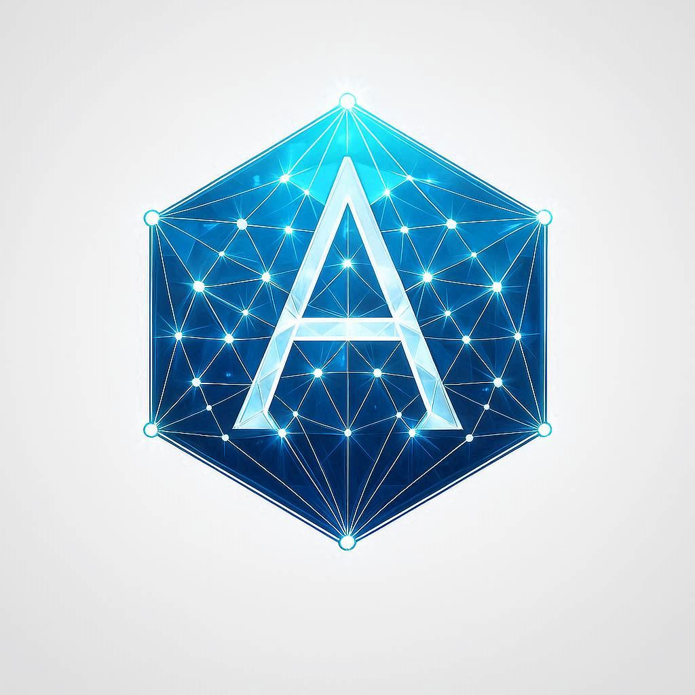

# ADAMAS Protocol (ADM)

  
   
  <h3>The Weightless Fortress.</h3>
  

    The world's first <b>Post-Quantum Layer-1</b> with WASM Smart Contracts & Mobile ZK-Verification. 
    Secure as a bunker. Light as a feather. Eternal by design.
  

---

## 1. The Manifesto: Solving the Trilemma

The blockchain industry is fragmented:
* **Bitcoin** is secure but slow, energy-intensive, and quantum-vulnerable.
* **Solana** is fast but centralizes power in massive data centers.
* **Ethereum** is versatile but burdened by legacy tech debt and heavy fees.

**Adamas is the Synthesis.**
We are building the first architecture that delivers **Quantum Security** without the data weight, and **High-Speed Programmability** without centralization, powered by a sustainable economic model designed to last into the 22nd century.

---

## 2. Core Innovations (The "Unfair" Advantage)

### A. Ephemeral Quantum Signatures (EQS) ™
*Solving the "Post-Quantum Bloat" problem.*
Standard quantum signatures (like Dilithium) are heavy (5KB+). Storing them bloats the chain.
**The Adamas Solution:**
1.  **Sign:** Users sign transactions off-chain via NIST-standard PQC algorithms.
2.  **Compress:** We utilize **Recursive ZK-STARKs** to compress the heavy signature into a tiny validity proof.
3.  **Store:** Only the tiny proof is stored on the ledger.
*Result: Military-grade security with the data-lightness necessary for global scale.*

### B. The Adamas Virtual Machine (AVM)
*Beyond Payments.*
Adamas is not just a currency; it is a global computer.
* **WASM-Based:** Developers can write high-performance Smart Contracts using Rust, C++, or Go.
* **Quantum-Safe:** The first execution environment resistant to quantum decryption attacks.

---

## 3. Tokenomics: The Golden Ratio Standard

Adamas rejects arbitrary supply caps. Our monetary policy is governed by universal mathematical laws.

* **Ticker:** $ADM
* **Total Supply:** **20,633,239 ADM** (Strict Hard Cap)

This figure corresponds exactly to the **35th Lucas Number ($L_{35}$)**. By adhering to the Lucas sequence (intrinsically linked to the Golden Ratio $\phi$), Adamas is **mathematically scarcer than Bitcoin**, embedding organic perfection directly into the protocol.

### Longevity & Emission Curve
Adamas utilizes a "Lucas Decay" emission function. Unlike abrupt halvings, issuance decreases smoothly with every block. The final ADM is projected to be minted circa **Year 2155**, ensuring network incentives for over a century before transitioning entirely to a fee-based security model.

### Genesis Distribution
* **Public Ecosystem:** 90% (Staking Rewards, Prover incentives, Community Treasury).
* **Team & Foundation:** **10%** (Strictly Capped).
    * *Vesting:* Locked in 4-Year Linear Vesting Smart Contracts with a 12-Month Cliff to ensure long-term alignment.
* **Bootstrap:** A fractional allocation utilized immediately for Genesis Validator security.
  
### Technical Architecture (Rust Implementation)
* **The Core:** Custom implementation of a Lattice-based Ledger using Rust's memory safety.
* **Consensus:** Proof-of-Quantum-Stake (PoQS) skeleton ready for Dilithium key integration.
* **Adamas Virtual Machine (AVM):** A stack-based execution environment (OpCodes: PUSH, ADD, SUB, MUL) designed for high-performance Smart Contracts. **[ACTIVE IN v0.1.0]**
* **Networking:** GossipSub P2P layer (libp2p stack) for decentralized propagation.

---

## 4. Technical Architecture: The Tri-Layer Ecosystem

Adamas introduces a novel **Hybrid Consensus Model** that separates execution, validation, and security into three distinct roles.

### A. The Mining Ecosystem (Participation Layers)
1.  **ZK-Provers ("The Muscle" - GPU Mining):**
    * Specialized nodes that compute heavy cryptographic math to generate ZK-STARK proofs, compressing the blocks. Rewarded for computational power.
2.  **Consensus Validators ("The Capital" - Staking):**
    * High-availability servers holding locked ADM collateral to order transactions and finalize the ledger. Rewarded with Staking APY.
3.  **Mobile Verifiers ("The Eyes" - Decentralization):**
    * Millions of consumer smartphones running the Adamas Light Client to cryptographically verify the ZK-proofs in milliseconds. Rewarded with micro-payments for securing the network.

### B. The Tech Stack
* **Language:** Rust (Memory safety & performance).
* **Cryptography:** CRYSTALS-Dilithium (Signatures) + Kyber (KEM).
* **Compression:** Recursive STARKs (Zero-Knowledge Rollup architecture).
* **VM:** WebAssembly (WASM).

---

## 5. Roadmap & Status

* **Phase I: The Foundation (COMPLETED)**
    * [x] Core Architecture in Rust.
    * [x] Lucas Supply Logic ($L_{35}$).
    * [x] Post-Quantum Wallet Structure (Dilithium-5 Simulation).
    * [x] Persistent Storage (Sled DB).
    * [x] Adamas Virtual Machine (AVM) v0.1.
    * [x] P2P Networking Skeleton (libp2p).
* **Phase II: The Engine (CURRENT)**
    * Cryptographic Library Integration (pqcrypto).
    * Full P2P Node Discovery.
    * Private Testnet Launch.
* **Phase III: The Awakening**
    * Public Incentivized Testnet.
    * Mobile Verifier App Beta Launch.

---

## 6. Contributing & Developers

Adamas is an open-source protocol built for the next century.
We are actively recruiting core contributors in the following areas:
* **Rust / Systems Programming** (Core Logic)
* **Applied Cryptography** (ZK-STARKs & Lattice-based Signatures)
* **Distributed Systems** (P2P Networking)

> *If you want to build the Post-Quantum future, fork this repo and submit a PR, or contact the Foundation.*

---

## License & Status

* **License:** MIT Open Source.
* **Status:** Pre-Alpha / Active Development.

> *"Mathematics is the only truth that endures. Adamas is built on mathematics."*
